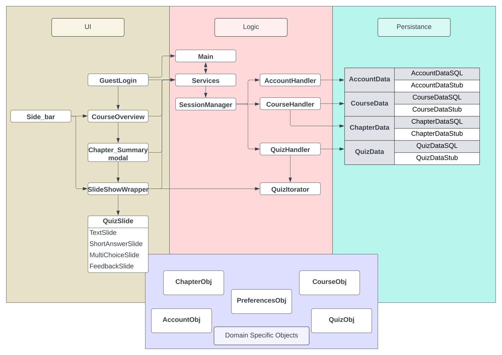

# Architecture

**Directory of Classes and their locations**

## Iteration 2 Diagram

## Iteration 1 Diagram

## UI Layer
[GuestLogin](../app/src/main/java/CodeLinguists/codelingo/ui/view_GuestLogin.java)
- The starting screen of the app, where you can login as guest

[CourseOverview](../app/src/main/java/CodeLinguists/codelingo/ui/cont_CourseOverview.java)
- Show the overview of the selected course

[ChapterSummary](../app/src/main/java/CodeLinguists/codelingo/ui/cont_ChapterSummary.java)
- Show the summary of the selected chapter

[SlideShowWrapper](../app/src/main/java/CodeLinguists/codelingo/ui/view_SlideShowWrapper.java)
- Wraps and instantiates quiz fragments

### Slide Fragments
[QuestionFragmentFactory](../app/src/main/java/CodeLinguists/codelingo/ui/slides/QuestionFragmentFactory.java)
- Factory class to generate slide fragments based in a QuizObj

[QuizSlide](../app/src/main/java/CodeLinguists/codelingo/ui/slides/QuizSlide.java)
- Abstract class to define slide fragment behaviour

[TextSlide](../app/src/main/java/CodeLinguists/codelingo/ui/slides/TextSlide.java)
- A slide to display plain text

[ShortAnswerSlide](../app/src/main/java/CodeLinguists/codelingo/ui/slides/ShortAnswerSlide.java)
- A slide to allow one line text inputs

[MultiChoiceSlide](../app/src/main/java/CodeLinguists/codelingo/ui/slides/MultiChoiceSlide.java)
- A slide to allow multiple select input

[FeedbackSlide](../app/src/main/java/CodeLinguists/codelingo/ui/slides/FeedbackSlide.java)
- A slide to provide feedback to the user.

## Application Layer
[Services](../app/src/main/java/CodeLinguists/codelingo/application/Services.java)
- Generates Singletons for logic and persistance layers, and handles dependency injection

[Main](../app/src/main/java/CodeLinguists/codelingo/application/Main.java)
- Sets and manages the filepath to the local database

[Strings](../app/src/main/java/CodeLinguists/codelingo/application/Strings.java)
- Stores all string literals

## Logic Layer
[SessionManager](../app/src/main/java/CodeLinguists/codelingo/logic/SessionManager.java)
- Primary access between UI and logic layer.

[AccountHandler](../app/src/main/java/CodeLinguists/codelingo/logic/AccountHandler.java)
- Manages accessing, storing, and validating account based operations. 

[CourseManager](../app/src/main/java/CodeLinguists/codelingo/logic/CourseHandler.java)
- Manages accessing course and chapter data. 

[QuizHandler](../app/src/main/java/CodeLinguists/codelingo/logic/QuizHandler.java)
- Manages accessing quiz data

[QuizIterator](../app/src/main/java/CodeLinguists/codelingo/logic/QuizIterator.java)
- Provides an iterator for navigating a quiz list

## Exceptions
[AccountNotFoundException](../app/src/main/java/CodeLinguists/codelingo/persistence/persistence_exceptions/AccountNotFoundException.java)
- Exception used on failed login

[AccountPermissionException](../app/src/main/java/CodeLinguists/codelingo/logic/logic_exceptions/AccountPermissionException.java)
- Exception used when trying to access features without being logged in

[CourseNotFoundException](../app/src/main/java/CodeLinguists/codelingo/persistence/persistence_exceptions/CourseNotFoundException.java)
- Exception used when request course was not found

[DataInaccessibleException](../app/src/main/java/CodeLinguists/codelingo/persistence/persistence_exceptions/DataInaccessibleException.java)
- Exception used when system fails to access data. Eg, when account creation fails

[EmptyListException](../app/src/main/java/CodeLinguists/codelingo/ui/ui_exceptions/EmptyListException.java)
- Exception used when trying to render a list without elements

[InputValidationException](../app/src/main/java/CodeLinguists/codelingo/logic/logic_exceptions/InputValidationException.java)
- The exception class for invalid inputs for constrained fields

[NoItemSelectedException](../app/src/main/java/CodeLinguists/codelingo/logic/logic_exceptions/NoItemSelectedException.java)
- Exception used when trying to submit empty data

[SlideTypeNotHandledException](../app/src/main/java/CodeLinguists/codelingo/ui/ui_exceptions/SlideTypeNotHandledException.java)
- Exception used when trying render an unsupported slide type

### RuntimeExceptions
[ConstantDependencyException](../app/src/main/java/CodeLinguists/codelingo/application/runtime_exceptions/ConstantDependencyException.java)
- Exception used when trying to change the persistence layer implementation while the app is running

[DBStateException](../app/src/main/java/CodeLinguists/codelingo/application/runtime_exceptions/DBStateException.java)
- Exception used when the DB cannot be accessed

## Persistence Layer
[IAccountData](../app/src/main/java/CodeLinguists/codelingo/persistence/IAccountData.java)
- The interface for accessing the accounts in the database

[IChapterData](../app/src/main/java/CodeLinguists/codelingo/persistence/IChapterData.java)
- The interface for accessing the chapters in the database

[ICourseData](../app/src/main/java/CodeLinguists/codelingo/persistence/ICourseData.java)
- The interface for accessing the courses in the database

[ISessionData](../app/src/main/java/CodeLinguists/codelingo/persistence/ISessionData.java)
- The interface for the inter-session persistant state data. 

[IQuizData](../app/src/main/java/CodeLinguists/codelingo/persistence/IQuizData.java)
- The interface to store all the quizzes

### Stubs
[AccountDataStub](../app/src/main/java/CodeLinguists/codelingo/persistence/stubs/AccountDataStub.java)
- Account stub "database" for the app

[ChapterDataStub](../app/src/main/java/CodeLinguists/codelingo/persistence/stubs/ChapterDataStub.java)
- Chapter stub "database" for the app

[CourseDataStub](../app/src/main/java/CodeLinguists/codelingo/persistence/stubs/CourseDataStub.java)
- Course stub "database" for the app

[SessionDataStub](../app/src/main/java/CodeLinguists/codelingo/persistence/stubs/SessionDataStub.java)
- Session stub "database" for the app

[QuizDataStub](../app/src/main/java/CodeLinguists/codelingo/persistence/stubs/QuizDataStub.java)
- Quiz stub "database" for the app

### SQL implementations
[AccountDataSQL](../app/src/main/java/CodeLinguists/codelingo/persistence/sql/AccountDataSQL.java)
- Account SQL database for the app. Uses an SqlRunner to control DB connections

[ChapterDataSQL](../app/src/main/java/CodeLinguists/codelingo/persistence/sql/ChapterDataSQL.java)
- Chapter SQL database for the app. Uses an SqlRunner to control DB connections

[CourseDataSQL](../app/src/main/java/CodeLinguists/codelingo/persistence/sql/CourseDataSQL.java)
- Course SQL database for the app. Uses an SqlRunner to control DB connections

[SessionDataSQL](../app/src/main/java/CodeLinguists/codelingo/persistence/sql/SessionDataSQL.java)
- Session SQL database for the app. Uses an SqlRunner to control DB connections

[QuizDataSQL](../app/src/main/java/CodeLinguists/codelingo/persistence/sql/QuizDataSQL.java)
- Quiz SQL database for the app. Uses an SqlRunner to control DB connections

### DB Utilities
[DbHelper](../app/src/main/java/CodeLinguists/codelingo/persistence/utils/DbHelper.java)
- Copies DB script assets into the active app directory in the device

[ISqlRunner](../app/src/main/java/CodeLinguists/codelingo/persistence/utils/ISqlRunner.java)
- Provides interface to connect to and run queries against a specific DB implementation

[HSQLDBRunner](../app/src/main/java/CodeLinguists/codelingo/persistence/utils/HSQLDBRunner.java)
- Provides access to the HSQLDB implementation

## Domain Specific Objects
[AccountObj](../app/src/main/java/CodeLinguists/codelingo/dso/AccountObj.java)
- The Account object

[ChapterObj](../app/src/main/java/CodeLinguists/codelingo/dso/ChapterObj.java)
- The Chapter object

[CourseObj](../app/src/main/java/CodeLinguists/codelingo/dso/CourseObj.java)
- The Course object

[QuizObj](../app/src/main/java/CodeLinguists/codelingo/dso/QuizObj.java)
- The Quiz object

[CourseObjFactory](../app/src/main/java/CodeLinguists/codelingo/dso/CourseObjFactory.java)
- Used to generate default CourseObj instances

[QuestionType](../app/src/main/java/CodeLinguists/codelingo/dso/QuestionType.java)
- An Enumerator to define quiz slide question types

## Docs

[View other docs](../Docs)
