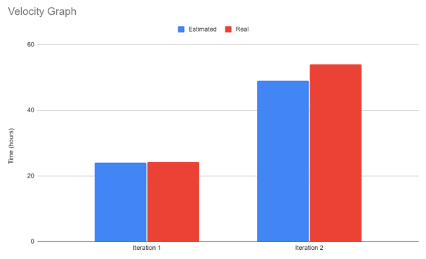

# Retrospective

## Discussion
Our team is very happy with how things turned out over the course of this project. As a team, we have tried to help each other and communicate to the best of our abilities. However, there are still areas of improvement and quite inevitably, some difficulties that had to be faced regardless.

### Timely Communication
Navigating the workload distribution among team members, especially for those newer to app development with Android Studio, did at times become overwhelming. Despite our best efforts, team members occasionally found it challenging to reach out for assistance at the right moment when they encountered difficulties in completing their tasks. Team members tended to seek assistance only when they struggled for too long, which unfortunately led to a lot of crunch work during the final few days of the iteration for the whole team. This rush often resulted in elevated chances of errors and smells in the production of our code that may not meet our usual standards of cleanliness and efficiency. However, our group understands these feelings and we appreciate the effort put in by the members. We tried to mitigate this issue either by stepping in to take on the remaining work or by strategically moving it to the next iteration if it wasn’t deemed a high-priority task.

### Over-engineering
We found ourselves occasionally over-designing the API and the backend before even beginning to work on the UI, which led to inefficiencies. A significant portion of our time was spent designing which eventually led some of the work to be stalled. Since a considerable proportion of the backend was developed before the frontend, some team members found it challenging to grasp how the UI would seamlessly integrate with the API . Additionally, we noticed that a significant amount of time was being spent in meetings, even when there weren’t many pressing matters to discuss. This approach ended up restricting the agility of our project, as it consumed valuable time that could have been spent on actual development tasks. During iteration 2, we came up with a way to mitigate this issue. We decided to split into groups and work on separate features. Team members were trusted with the work assigned to them which reduced time spent on designing significantly. At the end of a sprint, the entire group would come back together to review the features that were completed individually. 

### Over-ambitious
During iteration 1, our team's enthusiasm led us to aim for more than what was initially required, inadvertently throwing us off course. We poured significant time into developing and designing the API and various features, leaving the UI until the last minute. This approach left some team members feeling rushed when it came to implementing the UI, leading to a few regrettable decisions and a slight dip in morale. Recognizing the impact, we took compassionate steps to rectify the situation. Firstly, we reevaluated our priorities, shifting some features to iteration 2 to alleviate the workload. Secondly, we made a collective decision to prioritize UI development before delving into the intricate details of the logic layer interfaces. This adjustment provided a clearer sense of order and direction for the team in subsequent iterations, fostering a more supportive and balanced working environment.

### Success
Our team is fully committed to making sure that our app runs smoothly in every way possible. We're planning to achieve this with a group meeting where everyone will come together to hunt down any bugs or issues that need fixing. As we're nearing the final iteration, it's crucial that we tie up all loose ends and complete every partially working feature. This attention to detail reflects our dedication to delivering a top-notch product that users can rely on without any hiccups. By working together and giving everything a thorough review, we're aiming to ensure that the app performs consistently well, giving users a seamless experience they can count on.

## Project Velocity
